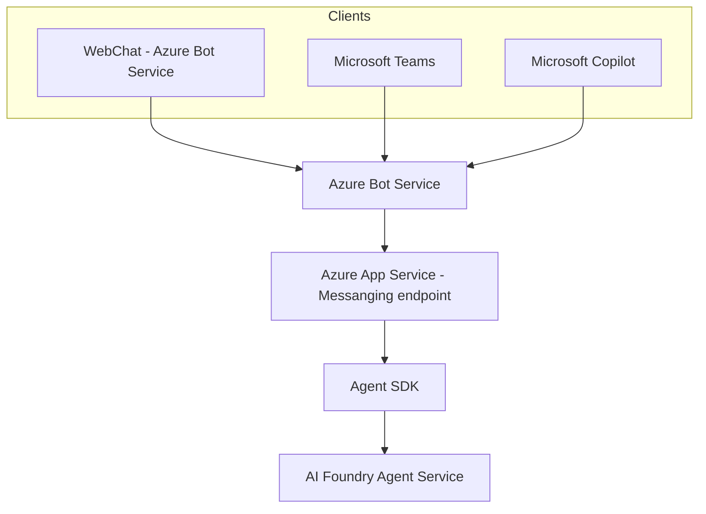

# Weather Prediction Agent

This project demonstrates a simple weather-forecasting Agent built with the Microsoft 365 Agents SDK, communicating directly with the Azure AI Foundry Agent service. The Agent receives user requests for weather forecasts and responds by leveraging the AI Foundry Agent, which in turn calls MSN Weather via a Logic App tool.

This sample is designed to introduce the basics of integrating the Agent SDK with Azure AI Foundry Agent service. It provides a foundation for building custom Agents that interact with AI Foundry agents.

## Architecture Diagram



## Prerequisites

-  [Python](https://www.python.org/) version 3.9 or higher
-  [dev tunnel](https://learn.microsoft.com/azure/developer/dev-tunnels/get-started?tabs=windows) (for local development)
- You will need an Azure OpenAI, with the preferred model of `gpt-4o-mini`.

## Local Setup

### Configure Azure Bot Service

1. [Create an Azure Bot](https://aka.ms/AgentsSDK-CreateBot)
   - Record the Application ID, the Tenant ID, and the Client Secret for use below

1. Configuring the token connection in the Agent settings
    1. Open the `env.TEMPLATE` file in the root of the sample project, rename it to `.env` and configure the following values:
      1. Set the **CONNECTIONS__SERVICE_CONNECTION__SETTINGS__CLIENTID** to the AppId of the bot identity.
      2. Set the **CONNECTIONS__SERVICE_CONNECTION__SETTINGS__CLIENTSECRET** to the Secret that was created for your identity. *This is the `Secret Value` shown in the AppRegistration*.
      3. Set the **CONNECTIONS__SERVICE_CONNECTION__SETTINGS__TENANTID** to the Tenant Id where your application is registered.

1. Configure the Azure OpenAI settings in the Agent settings
   1. Set **AZURE_OPENAI_API_VERSION** to an OpenAI API version such as ` 2025-01-01-preview`
   1. Set **AZURE_OPENAI_ENDPOINT** to the endpoint for your Azure OpenAI instance. For example, if using an Azure AI Foundry named `testing`, the endpoint would be `https://endpoint.openai.azure.com/`


1. Run `dev tunnels`. See [Create and host a dev tunnel](https://learn.microsoft.com/azure/developer/dev-tunnels/get-started?tabs=windows) and host the tunnel with anonymous user access command as shown below:

   ```bash
   devtunnel host -p 3978 --allow-anonymous
   ```

1. Take note of the url shown after `Connect via browser:`

1. On the Azure Bot, select **Settings**, then **Configuration**, and update the **Messaging endpoint** to `{tunnel-url}/api/messages`

### Running the Agent

1. Open this folder from your IDE or Terminal of preference
1. (Optional but recommended) Set up virtual environment and activate it.
1. Install dependencies

```sh
pip install -r requirements.txt
```

### Run in localhost, anonymous mode

1. Start the application

```sh
python -m src.main
```

At this point you should see the message 

```text
======== Running on http://localhost:3978 ========
```

The agent is ready to accept messages.

## Accessing the Agent

### Using the Agent in WebChat

1. Go to your Azure Bot Service resource in the Azure Portal and select **Test in WebChat**


## Further reading
To learn more about building Agents, see our [Microsoft 365 Agents SDK](https://github.com/microsoft/agents) repo.